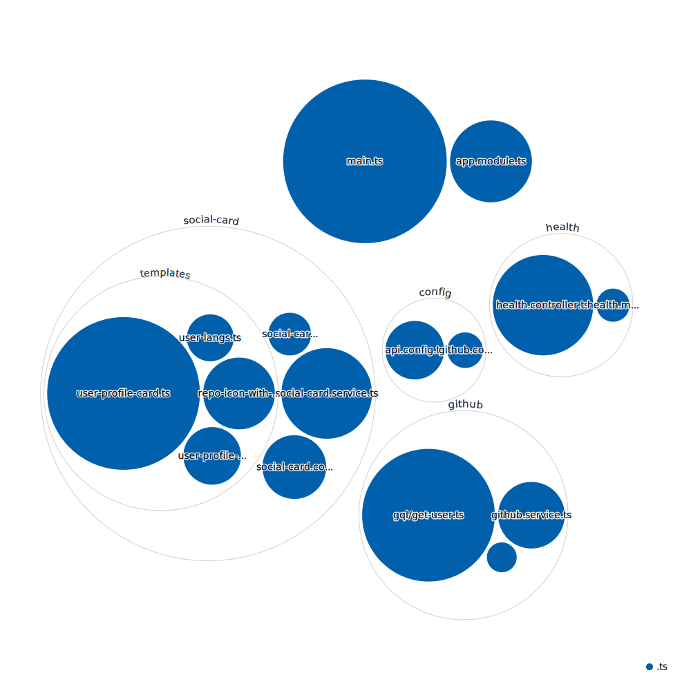

<div align="center">
  <br>
  
  <h1>🍕 Open Sauced Open Graph Generator 🍕</h1>
  <strong>The path to your next Open Source contribution</strong>
  <br>
  <br>
  <a href="https://www.digitalocean.com/?refcode=c65a90d0956d&utm_campaign=Referral_Invite&utm_medium=Referral_Program&utm_source=badge"></a>
</div>
<br>
<p align="center">
  
  
  <a href="https://github.com/open-sauced/opengraph.opensauced.pizza/issues">
    
  </a>
  <a href="https://github.com/open-sauced/opengraph.opensauced.pizza/releases">
    
  </a>
  <a href="https://discord.gg/U2peSNf23P">
    
  </a>
  <a href="https://twitter.com/saucedopen">
    
  </a>
</p>

## 🚀 Live release environments

- [digital ocean](https://cloud.digitalocean.com/droplets/319848644)

## 📖 Prerequisites

In order to run the project we need the following software binaries installed on our development machines:
- `node>=16.7.0`
- `npm>=8.0.0`
- `docker>=20.10.12`

## 🖥️ Local development

To install the application:

```shell
npm ci
```

To start a local copy of the app on port `3001`:

```shell
npm run start:dev
```

### 📝 Environment variables

Some environment variables are required to run the application. You can find them in the `.env.example` file. While most of them are optional, some are required to run the application.

Boilerplate, changed mostly locally:

```dotenv
# Global env
API_HOST=0.0.0.0
API_PORT=3003
SERVICE_DOMAIN=opensauced.pizza
```

### 🎨 Code linting

To check the code and styles quality, use the following command:

```shell
npm run lint
```

This will also display during development, but not break on errors.

To fix the linting errors, use the following command:

```shell
npm run format
```

It is advised to run this command before committing or opening a pull request.

### 📕 Types

We have a couple of scripts to check and adjust missing types.

In order to dry run what types would be added to `package.json`:

```shell
npm run types:auto-check 
```

In order to add any missing types to `package.json`:

```shell
npm run types:auto-add
```

### 🚀 Production deployment

A production deployment is a complete build of the project, including the build of the static assets.

```shell
npm run build
```

## 🤝 Contributing

We encourage you to contribute to Open Sauced! Please check out the [Contributing guide](https://docs.opensauced.pizza/contributing/introduction-to-contributing/) for guidelines about how to proceed.


## 🍕 Community

Got Questions? Join the conversation in our [Discord](https://discord.gg/U2peSNf23P).  
Find Open Sauced videos and release overviews on our [YouTube Channel](https://www.youtube.com/channel/UCklWxKrTti61ZCROE1e5-MQ).

## 🎦 Repository Visualization

Below is visual representation of our code repository. It is generated by [Octo Repo Visualizer](https://github.com/githubocto/repo-visualizer).

This visualization is being updated on release to our default branch by our [release workflow](./.github/workflows/release.yml).

[
](./src)

## ⚖️ LICENSE

MIT © [Open Sauced](LICENSE)
